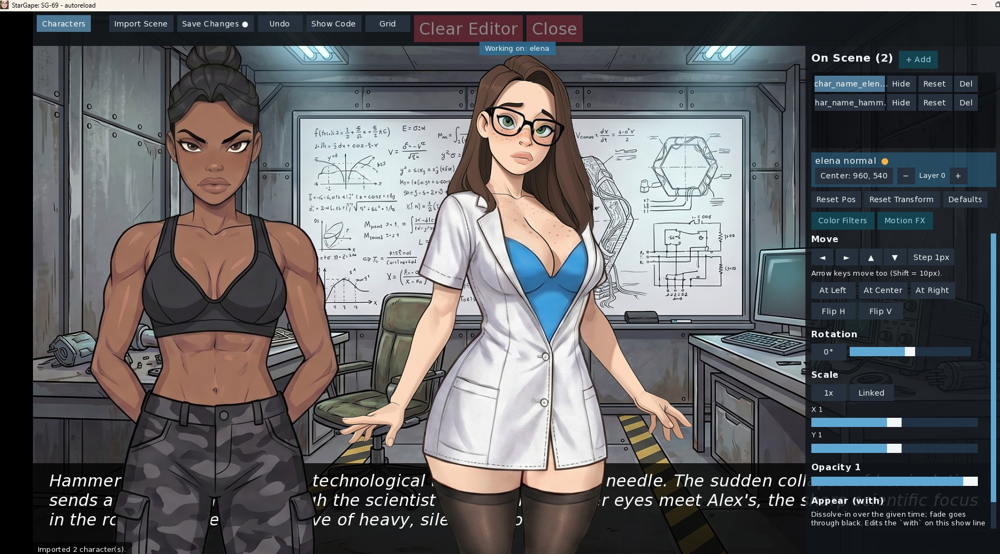
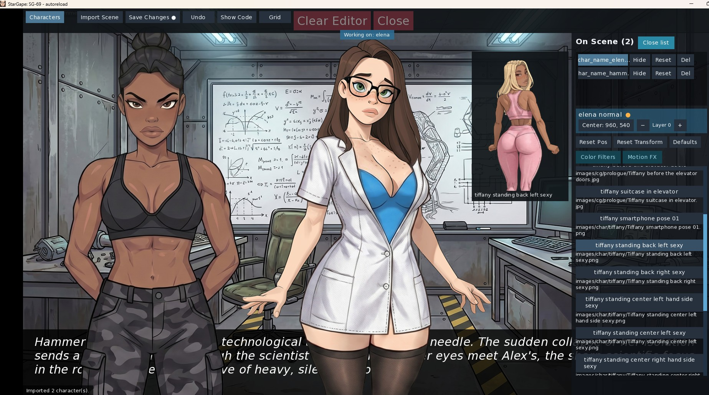
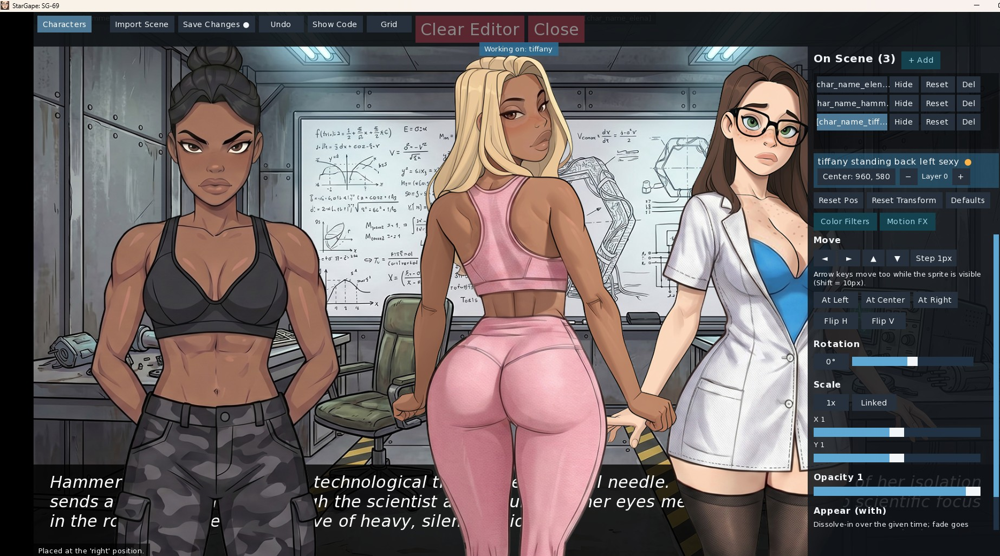
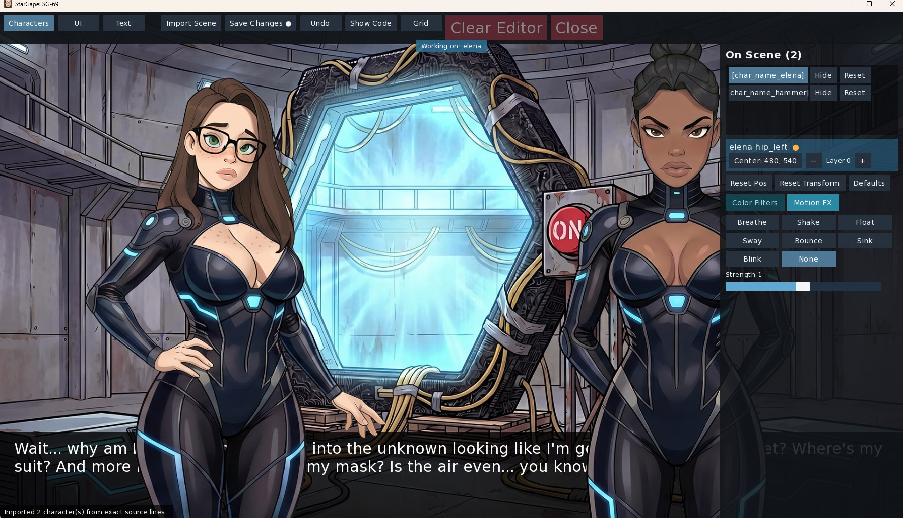
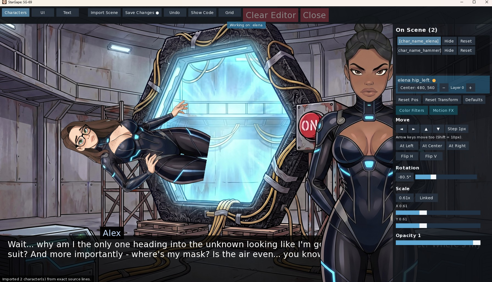
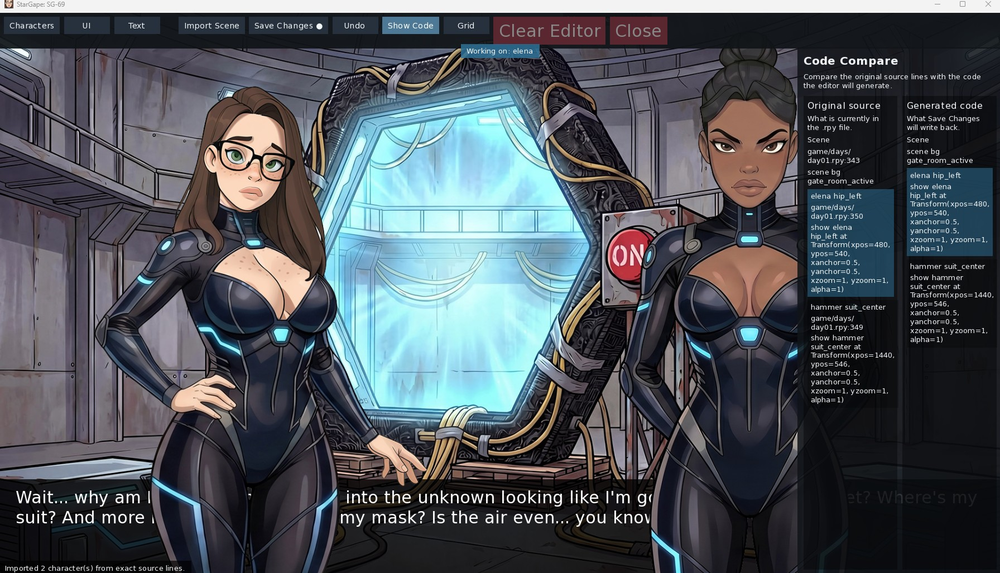

# Ren'Py Drag-and-Drop WYSIWYG Editor (v0.2.0)

A powerful, single-file overlay tool for Ren'Py games that allows creators to arrange, rotate, scale, animate, and filter sprites visually in real-time, writing the code directly back to the `.rpy` source files.

No more guess-and-test positioning or editing coordinates in your text editor. Just hit **F5**, drag your characters to the perfect spots, tweak their properties, and save.

---

## Screenshots

### 1. Initial Launch Overlay (F5)

*The clean editor overlay immediately after launching it with the F5 key.*

### 2. Main Interface (After Scene Import)

*The main panel displaying imported sprites, character lists, and basic layout buttons.*

### 3. Color Filters Menu in Action

*Real-time rendering of filters including blur, brightness, contrast, saturation, hue shift, inversion, and sepia.*

### 4. Motion FX Animations

*Configuring dynamic animations like breathe, shake, float, sway, bounce, sink, and blink with custom strengths.*

### 5. Advanced Transformations (Rotation & Scaling)

*Demonstration of precise rotation adjustments, linked/unlinked scaling, and image flipping.*

### 6. Code Compare Panel (Show Code)

*Side-by-side comparison of the original script lines vs. the newly generated code before writing to disk.*

---

## Key Features

- **Live Drag-and-Drop Layout**: Click and drag any sprite on the screen to reposition it instantly.
- **Direct Source Code Rewriting**: When you click **Save Changes**, the editor locates the exact `show` or `scene` statements that rendered the active sprites (using Ren'Py's execution line log `config.line_log`) and rewrites the parameters in-place inside your `.rpy` files using `renpy.scriptedit`.
- **Automatic Backups + Write Verification**: Before every save, each touched file is backed up into `game/wysiwyg_backups/` (rotated, 10 newest per file plus the session baseline). After every save the whole file is re-parsed with the engine parser — if anything is wrong, the backup is restored automatically on the spot.
- **Only Changed Lines Are Written**: Characters you did not modify are never rewritten, so untouched statements keep their original transitions, at-lists and formatting.
- **Animated Characters Are Locked, Not Broken**: A character shown with an animated ATL block or a custom transform is imported as *locked* — it stays live and animated on screen, cannot be dragged, and its source line is never rewritten. Static placements (`at left/center/right`, plain `Transform(...)`, static ATL blocks) stay fully editable.
- **Motion FX are self-contained**: the first save that uses a Motion FX also writes `game/wysiwyg_motion_fx.rpy` with standalone transform definitions, so saved lines keep working even if you remove the editor before release.
- **Bypasses Default Anchors**: Grabs live bounds via `renpy.get_image_bounds`. The parsed source line is only trusted if it matches the live render within 2 pixels, making the editor work in any game regardless of its custom anchors or menu branches.
- **Center-Based Anchoring**: Saves lines in the format `show TAG at Transform(xpos=CX, ypos=CY, xanchor=0.5, yanchor=0.5, ...)`. Center anchors are invariant under rotation and scaling, and explicit anchors prevent issues with default game configurations.
- **Rotated Bounding Box Match**: The drag container matches the renderer's exact rotated bounding box (incorporating `rotate_pad=True` calculations and integer clipping) to avoid 1px shifting bugs when saving.
- **Virtual Resolution Scaling**: Designed at 1080p, the editor UI automatically scales using `config.screen_height / 1080.0`, keeping it proportional at any resolution (e.g. 720p or 4K).
- **Core Transform Controls**:
  - Horizontal/Vertical flipping (`xzoom`/`yzoom`).
  - Linked/Unlinked scale locking.
  - Rotation slider & manual degree input.
  - Opacity/Alpha slider.
  - Layout presets (At Left, At Center, At Right).
- **Color Filters**: Apply live filters including Blur (px), Brightness, Contrast, Saturation, Hue rotation, Inversion, and Sepia matrices using `matrixcolor`.
- **Motion FX Animations**: Toggle built-in animated effects (breathe, shake, float, sway, bounce, sink, blink) with adjustable strength.
- **Grid Overlay**:
  - Toggleable background grid overlay with 100px steps to help with visual alignment.
- **Undo Stack**: Maintains a history of up to 50 operations.
- **Code Compare Panel**: View your original source lines side-by-side with the generated code before writing to disk.

---

## Interface & Controls Reference

### 1. Global Toolbar (Top)
- **Characters** (Tab): Selects the character editing panel. (Additional tabs for *UI* and *Text* are currently prepared for future expansions).
- **Import Scene**: Scans the active Ren'Py master layer, finds the exact source files and lines, and loads the sprites into the editor.
- **Save Changes**: Rewrites the mapped lines in your `.rpy` files in-place with the updated `Transform` code.
- **Undo**: Undoes the last modification (holds up to 50 steps).
- **Show Code**: Opens the side-by-side code comparison panel to preview modifications before writing to disk.
- **Grid**: Toggles a 100px-step background alignment grid to help with visual alignment.
- **Clear Editor**: Resets the editor state, discarding all unsaved transformations.
- **Close**: Safely exits the editor, restoring the scene back to its pre-editor state.

### 2. Base Controls Panel
- **Reset Pos**: Restores the character's X and Y coordinates to their initial imported state.
- **Reset Transform**: Restores the character's scale, rotation, and opacity back to the values originally defined in the script.
- **Defaults**: Resets the character to default parameters (rotation `0`, scale `1.0`, opacity `1.0`).
- **At Left / At Center / At Right**: Snaps the character to standard Ren'Py horizontal alignments.
- **Flip H / Flip V**: Mirrors the character horizontally or vertically (toggles negative `xzoom` or `yzoom`).
- **Rotation Slider**: Rotates the character between `-180°` and `180°`.
- **Linked / Unlinked**: Locks or unlocks the scale aspect ratio. When locked, scaling the X axis scales the Y axis proportionally.
- **Scale Sliders**: Changes the character's zoom level.
- **Opacity Slider**: Changes the character's transparency (`alpha`) from `0.0` (invisible) to `1.0` (opaque).
- **Nudge Buttons (`◄`, `►`, `▲`, `▼`)**: Move the selected character in 1px or 10px increments.
- **Nudge Step Toggle**: Click the **Step 1px / Step 10px** button to toggle the movement resolution for both the screen buttons and your keyboard's arrow keys.

> [!TIP]
> **In-place Value Editing**: You can click directly on the **Coordinates label** (`x=... y=...`), the **Rotation angle**, or the **Scale values** in the panel to turn them into manual input fields. This allows you to type exact numbers from your keyboard (e.g. typing `960, 540` to set the center position, `45.5` for rotation, or `0.85` for scale). Press **Enter** to commit the value.

### 3. Color Filters Panel
- **Defaults**: Resets all color matrix transformations back to their original values.
- **Reset (next to sliders)**: Resets only that specific filter back to its default state.
- **Blur**: Gaussian blur in pixels (`0px` to `20px`).
- **Brightness**: Adjusts image brightness matrix.
- **Contrast / Saturation / Hue / Invert**: Adjusts respective color filters dynamically.
- **Sepia ON/OFF**: Toggles a custom sepia matrix.

### 4. Motion FX Panel
- **Defaults**: Disables active motion animations.
- **Breathe / Shake / Float / Sway / Bounce / Sink / Blink**: Selects and runs the corresponding animation loop on the active character.
- **Strength**: Adjusts the speed, range, or amplitude of the selected animation.

---

## Installation

1. Copy the file `wysiwyg_editor.rpy` into the `game/` directory of your Ren'Py project.
2. Launch your game.
3. The editor is now integrated and ready to use!

---

## Usage Guide

1. Play your game until you reach a scene containing sprites you want to edit.
2. Press **F5** on your keyboard to open the editor overlay.
3. Click **Import Scene** to read the characters currently shown on screen.
4. Select a character from the **On Scene** list or click them directly.
5. Drag the sprite to your desired position. You can also:
   - Use the **arrow keys** on your keyboard to nudge the sprite by 1px (or hold **Shift** to nudge by 10px).
   - Go to **Base Controls** to adjust rotation, scale, opacity, or flip the character.
   - Go to **Color Filters** to add blurs, brightness/contrast adjustments, or hue shifts.
   - Go to **Motion FX** to apply animations.
6. Click **Show Code** to compare your changes with the original code.
7. Click **Save Changes** to write the updated coordinates directly to your `.rpy` files.
8. Click **Close** (or press **F5**) to exit the editor. Unsaved changes will be discarded, restoring the scene to its initial state.

---

## Technical Notes

### Viewport Vertical Scrollbar Workaround
Ren'Py 8.5.x has a known bug where `scrollbars "vertical"` inside a `viewport` silently breaks child rendering or shows an empty viewport. This editor bypasses the issue entirely by using a separate `vbar` component mapped to `YScrollValue`, combined with `mousewheel True` and `draggable True` on the viewport.

### File Backups & Write Verification
Every click of **Save Changes** first copies each file it is about to touch into `game/wysiwyg_backups/<file>.<timestamp>.bak` — so every save has its own restore point, not just the first one of the session.

After writing, the editor immediately re-parses the whole file with Ren'Py's own parser:

- if the file parses, the save is confirmed in the status bar ("verified");
- if it does not, the pre-save backup is **restored automatically**, the save is reported as failed, and saving to that file is disabled until the game restarts (so a desynced session cannot keep writing).

> [!NOTE]
> The backups folder is rotated automatically: the 10 newest backups per file are kept, plus the first backup of the current session (your pre-editor baseline). Delete `game/wysiwyg_backups/` whenever you want a clean slate.

To restore an original file manually, replace the modified `.rpy` file with the corresponding `.bak` from `game/wysiwyg_backups/`.

### Locked (Read-Only) Characters
Characters whose `show` statement uses an **animated ATL block** (e.g. `linear`, `ease`, `repeat`), a **custom named transform**, or that were shown **from Python code**, are imported as *locked*:

- they stay live on the master layer — their animation keeps playing while you edit others;
- they cannot be selected, dragged or reset, and their source line is **never rewritten**;
- the On Scene list and Show Code panel state the reason (e.g. `uses transform 'wobble'`).

Static placements are not affected: `at left`, `at center`, `at right`, explicit `Transform(...)` calls and ATL blocks containing only static properties (`xpos`, `ypos`, `zoom`, …) remain fully editable.

### Non-interactive Quit Confirmation Block
If you click the OS window's close **"X"** button to exit the game while the editor overlay is open, Ren'Py's default quit confirmation prompt ("Are you sure you want to quit?") will appear, but you will be unable to click "Yes" or "No". 

This occurs because the active editor screen uses `modal True`, which intercepts all inputs and blocks interaction with the screens underneath it. To close the game, simply close the editor first (by pressing **F5** or clicking **Close**), and you will then be able to interact with the quit prompt.

---

## License

This project is open-source and free to use in any personal or commercial Ren'Py game.
